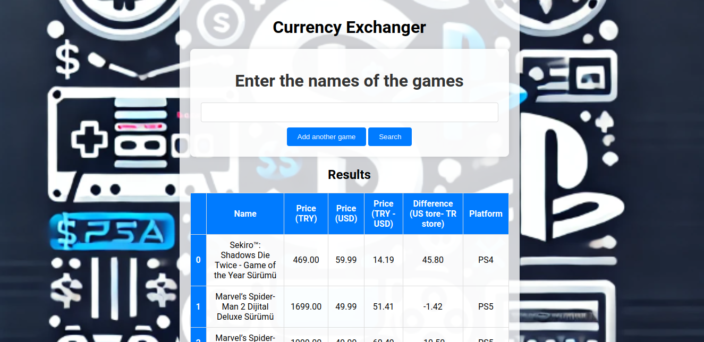

# Currency-Converter

Tired of buying games at full price? Do you have no money but tons of time and know how to use Python to entertain yourself in your lack of video games and/or friends to hang out with when you have nothing else to do? Well, have I got a solution for you!

I present... Well, this thing. Actually, I don’t know what it’s going to do just yet, but give me some time, a few commits, and a little magic touch of caffeine, and I’ll try to give you the best store to buy cheap games on the PS Store, depending on your country and currency.

So, sit tight and let me work some coding magic. Who knows, maybe you’ll save enough to buy that game and finally have a reason to stop debugging (at least for a while)!

## Purpose

Well, at least that is clear. When you buy a game on the PlayStation Store, you usually get a price based on your region. If you're from a poorer region, you're probably getting a cheaper price. And I can say that because, well, I’m actually poor. In fact, I haven’t eaten properly in the last few days because I got so engrossed in developing this app that I completely forgot to eat (Not true but, you get the jk)

Aaaaanyway, the point is, I’m here to give you the tools to create an app that essentially searches and compares prices via web scraping in different PS Store regions (US and TR) to discover the differences.

Why the Turkey region? Simple. It’s one of the cheapest regions to buy games, and I’m going to show you how to take advantage of that.

So buckle up and get ready to save some serious cash on your gaming addiction!

## The app

Well, I am a statistician. I know about models, machine learning, data science, and trends, but very little about web development. That explains a lot about why my webpage is kind of... "rustic." But hey, it has its own particular beauty. With some Chat GPT prompts and a lot of faith, we got this style of webpage.

You will input a game's name, and with a bit of magic, it will show a table comparing prices between regions.

## The project structure

Very simple, just a normal Python project. The main executable is in the "dev" folder, where you'll find an app.py file. Execute it, and let the magic begin.

There are other interesting folders like the "notebook" folder. Here, you can find the way I created this particular Python project. It starts first with scraping.ipynb, then goes to api.ipynb, and finally, html_dev.md.

These files will guide you through the logic of each program. I like to do it this way in case I need something from this in the future to reuse and understand its logic.

And of course, we also have the typical requirements.txt file and the env folder. Just the way we like it.

## API deployment

Well, I'd like the idea of having something functional and useful. To do that, we will store this program in a free API manager to run and have a functional web page. Indeed, I already mounted it on Render (https://render.com/), where I can store my personal projects.

If you're interested in giving this app a try, here is the link:

https://currency-converter-tfs2.onrender.com

Be aware of something: as Render offers a free service, it might be shut down if I haven't activated it via command. But I assure you, it works more than just fine c:

## Final words

This was a project for meere entertaingin and personal use. I do not authorize the distribution of these program with commercial purposes. Althou i would like to, cant imagine how to be honest. 